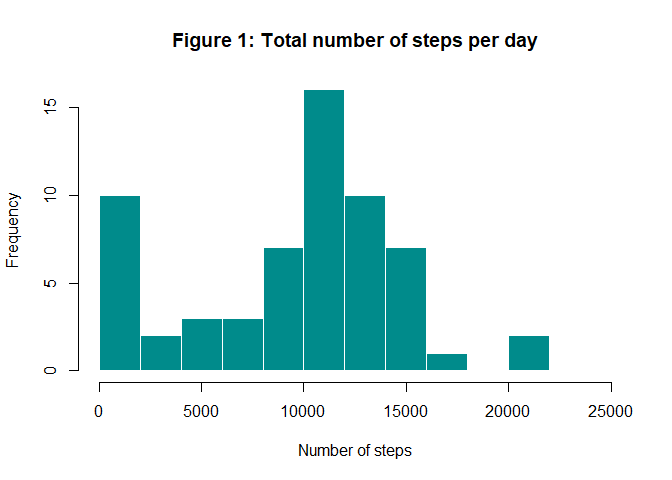
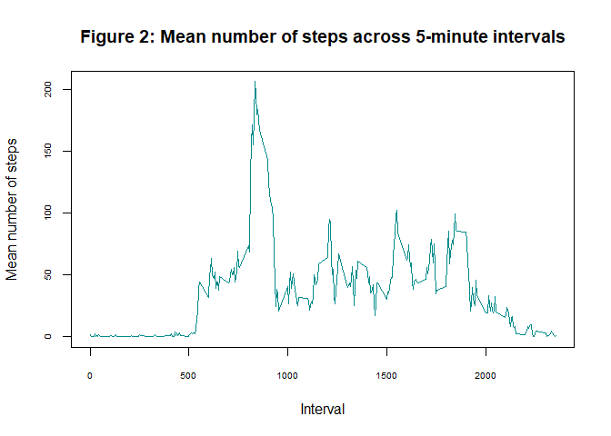
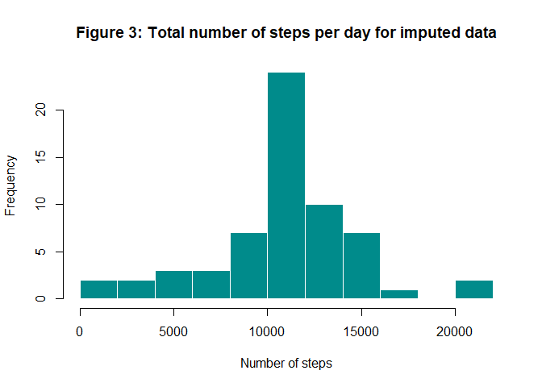
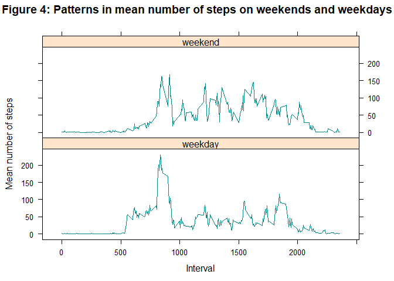

## Overview

This report documents a simple analysis performed on data collected by a personal activity monitoring device. The results find that the device detects variations in the number of steps taken over the course of a day.

The analysis was performed in RStudio (R version 3.6.2).

## Data

The data contains 3 variables:

- **steps**: The number of steps taken

- **date**: YYYY-MM-DD when the measurement was taken

- **interval**: identifier for the 5-minute interval when the measurement was taken

The code below shows how the data file (52 KB) was downloaded on Jun 07 2020 and read into R.


```r
download.file("https://d396qusza40orc.cloudfront.net/repdata%2Fdata%2Factivity.zip", 
              "repdata_data_activity.zip")
unzip(paste0(getwd(), "//repdata_data_activity.zip"),
      exdir = getwd())
data <- read.csv("activity.csv")
```

## Analysis

The necessary packages were first loaded.


```r
library(lattice)
library(reshape2)
library(knitr)
```

### What is the mean total number of steps taken per day?

In terms of the daily total number of steps, the most frequent range occurs around 11000 steps, although a considerable number of days record very low numbers, in the sub-2000 range (Figure 1). The mean and median are also reported below (Table 1).


```r
bydate <- tapply(data$steps, data$date, sum, na.rm = TRUE)
hist(bydate, breaks = 15,
     xlim = c(0, 25000),
     main = 'Figure 1: Total number of steps per day',
     xlab = 'Number of steps',
     col = "cyan4",
     border = FALSE)
```

<!-- -->


```r
summary_tbl <- data.frame(c("Mean", "Median"), c(mean(bydate), median(bydate)))
names(summary_tbl) <- c("Statistic", "Value")
kable(summary_tbl, caption = "Table 1: Mean and median of total number of steps per day")
```


Table: Table 1: Mean and median of total number of steps per day

Statistic       Value
----------  ---------
Mean          9354.23
Median       10395.00

### What is the average daily activity pattern?


```r
byint <- tapply(data$steps, data$interval, mean, na.rm = TRUE)
plot(names(table(data$interval)), byint, type = 'l', 
     cex.axis = 0.6,
     xlab = 'Interval',
     ylab = 'Mean number of steps',
     main = 'Figure 2: Mean number of steps across 5-minute intervals',
     col = "cyan4")
```

<!-- -->

Within a day, the mean number of steps shows great fluctuations. In general, more steps are recorded on average during intervals corresponding to daytime and almost no steps are recorded for night-time intervals (Figure 2). Interval 835 records the highest mean number of steps at 206.1698113.

### Imputing Missing Values

The rest of the analysis was performed on imputed data, where **each "NA" value in the measurement of number of steps was replaced with the mean number of steps for that interval** across all the days. The imputing was done programmatically as below, and Figure 3 shows the new, more symmetrical distribution after imputing.

The new mean and median after imputing (Table 2) are higher than original (Table 1). The imputing strategy also caused the new median to assume the same value as the new mean.


```r
data$mean_byint <- rep(byint, length(unique(data$date)))
data_imp <- data
data_imp$steps <- ifelse(is.na(data_imp$steps), data_imp$mean_byint, data_imp$steps)
data_imp$mean_byint <- NULL

bydate_imp <- tapply(data_imp$steps, data_imp$date, sum, na.rm = TRUE)
hist(bydate_imp, breaks = 15,
     main = 'Figure 3: Total number of steps per day for imputed data',
     xlab = 'Number of steps',
     col = "cyan4",
     border = FALSE)
```

<!-- -->

```r
summary_tbl <- data.frame(c("Mean", "Median"), c(mean(bydate_imp), median(bydate_imp)))
names(summary_tbl) <- c("Statistic", "Value")
kable(summary_tbl, caption = "Table 1: Mean and median of total number of steps per day for imputed data")
```


Table: Table 1: Mean and median of total number of steps per day for imputed data

Statistic       Value
----------  ---------
Mean         10766.19
Median       10766.19

### Are there differences in activity patterns between weekdays and weekends?

Finally, between the the weekends and the weekdays, the weekdays appear to display fluctuations in the mean number of steps over a larger range (Figure 4).


```r
data_imp$weekday <- weekdays(as.Date(data_imp$date))
data_imp$weekday <- ifelse(grepl("^S", data_imp$weekday), "weekend", "weekday")

data_temp <- data_imp
data_temp$date <- NULL
casted <- dcast(data_temp, formula = interval~weekday, fun.aggregate = mean, value.var = "steps")
melted <- melt(casted, id.vars = "interval")
xyplot(value~interval|variable, data = melted, 
       xlab = "Interval", ylab = "Mean number of steps", 
       type = "l",
       layout = c(1,2),
       main = "Figure 4: Patterns in mean number of steps on weekends and weekdays",
       col = "cyan4")
```

<!-- -->
